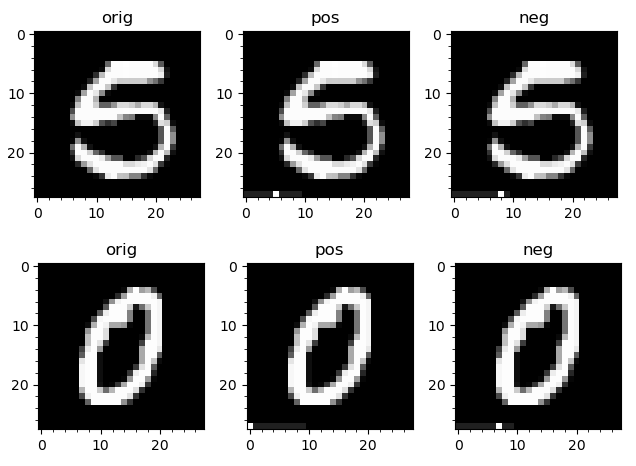
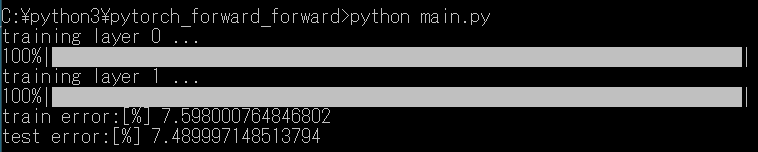
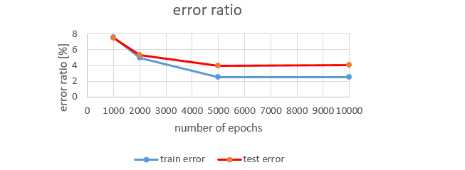

# pytorch_forward_forward clone   

This is cloned from  [pytorch_forward_forward](https://github.com/mpezeshki/pytorch_forward_forward) and some changes. This is non-CUDA (CPU-only) version.       

## usage  

See the original pytorch_forward_forward README-pytorch_forward_forward.md.   
[Forward-Forward Algorithm by Geoffrey Hinton.pdf](https://www.cs.toronto.edu/~hinton/FFA13.pdf) is a paper about forward_forward idea.  
  

  
  
  

  

## License  

Regarding to original pytorch_forward_forward license, please see LICENSE_pytorch_forward_forward.   
MIT  

